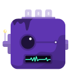
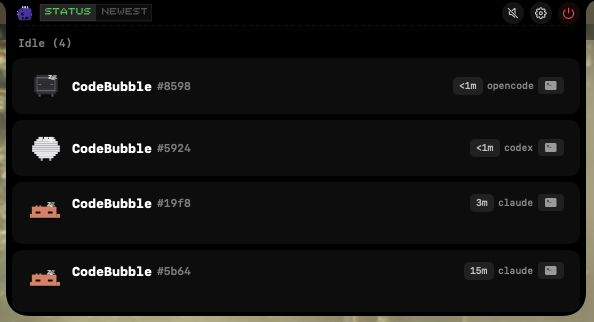

<h1 align="center">
  &nbsp;
  CodeBubble
</h1>
<p align="center">
  <b>Status panel for AI coding agents, lives in your MacBook's notch</b><br>
  <a href="#installation">Install</a> •
  <a href="#features">Features</a> •
  <a href="#supported-agents">Supported Agents</a> •
  <a href="#build-from-source">Build</a>
</p>

<p align="center">
  
</p>

---

## What is CodeBubble?

CodeBubble lives in your MacBook's notch area and shows what your AI coding agents are doing — in real time. No more window switching to check if Claude is still working or if your Codex session is done.

It **passively observes** session state by watching each agent's data files (JSONL transcripts and SQLite databases). No hooks, no injected code, no modification of agent configs — CodeBubble just reads what's already there.

## Features

- **Notch-native UI** — Expands from the MacBook notch, collapses when idle
- **Zero configuration** — No hooks to install, no configs to modify
- **Live status tracking** — See active sessions, tool calls, and thinking state as they happen
- **Process-aware** — Only shows sessions with a live agent process
- **Pixel-art mascots** — Each supported agent has its own animated character
- **One-click jump** — Click a session to jump to its terminal window or tab
- **Global shortcuts** — Toggle panel, jump to terminal from anywhere
- **Sound effects** — Optional 8-bit notifications for session events
- **Multi-display** — Auto-detects notch displays, works with external monitors
- **Multilingual UI** — English, 简体中文

## Supported Agents

| | Agent | Data Source | Detection |
|:---:|------|-------------|-----------|
|  | **Claude Code** | `~/.claude/projects/*/*.jsonl` | PID file + process scan |
|  | **Codex** | `~/.codex/state_5.sqlite` | Process scan + CWD match |
|  | **OpenCode** | `~/.local/share/opencode/opencode.db` | Process scan + CWD match |

## Installation

### Homebrew (Recommended)

```bash
brew tap cchitsiang/tap
brew install --cask codebubble
```

### Manual Download

1. Go to [Releases](https://github.com/cchitsiang/CodeBubble/releases)
2. Download `CodeBubble.dmg`
3. Open the DMG and drag `CodeBubble.app` to your Applications folder
4. Launch CodeBubble — sessions will appear automatically as your agents run

> **Note:** On first launch, macOS may show a security warning. Go to **System Settings → Privacy & Security** and click **Open Anyway**.
>
> For global shortcuts to work, grant **Accessibility** permission in **System Settings → Privacy & Security → Accessibility**.

### Build from Source

Requires **macOS 14+** and **Swift 5.9+**.

```bash
git clone https://github.com/cchitsiang/CodeBubble.git
cd CodeBubble

# Development — quick debug build + ad-hoc codesign
./build.sh --debug
.build/arm64-apple-macosx/debug/CodeBubble

# Dev with hot-reload — press R to rebuild and relaunch
./run.sh

# Release — universal binary (Apple Silicon + Intel), code-signed
./build.sh
open .build/release/CodeBubble.app
```

## How It Works

```
Claude Code                Codex                    OpenCode
  ↓                          ↓                        ↓
JSONL transcripts       SQLite (state_5.sqlite)   SQLite (opencode.db)
  ↓                          ↓                        ↓
   └─────────┬────────────────┴────────────────────┘
             ↓
     ClaudeProvider / CodexProvider / OpenCodeProvider
             ↓
     SessionMonitor  (polls every 3s)
             ↓
         AppState
             ↓
     Notch Panel UI
```

CodeBubble polls each agent's data store every 3 seconds. For each source:

- **Claude** — Reads `~/.claude/sessions/{pid}.json` for live PIDs, then parses the last ~20 entries of the corresponding JSONL file. Falls back to scanning the process table by CWD when PID files aren't available.
- **Codex / OpenCode** — Scans the process table for running `codex` / `opencode` binaries, then matches each process's CWD to a row in the SQLite database. Processes without a DB row are shown as idle.

Session status is derived from the last message in the transcript:

| State | Derived from |
|-------|--------------|
| **Working** | User just sent a message OR AI is generating with no `stop_reason` (< 30s old) |
| **Tool Use** | Last assistant message has `stop_reason: tool_use` OR an active tool part (< 60s old) |
| **Idle** | AI finished responding (`stop_reason: end_turn`) or no recent activity |
| **Waiting** | AI is explicitly asking the user a question |

Sessions are removed immediately when their process exits — no stale entries.

## Settings

CodeBubble provides a tabbed settings panel:

- **General** — Language, launch at login, display selection
- **Behavior** — Auto-hide when idle, auto-collapse on mouse leave, session cleanup
- **Appearance** — Panel height, font size, AI reply lines
- **Mascots** — Preview all pixel-art characters and animation speed
- **Sound** — 8-bit sound effects for session events
- **Shortcuts** — Configure global keyboard shortcuts (requires Accessibility permission)
- **About** — Version info and GitHub links

## Global Shortcuts

| Action | Default |
|--------|---------|
| Toggle panel | ⌘⇧I |
| Jump to active session's terminal | Unset |

Shortcuts are configured in **Settings → Shortcuts** and require macOS Accessibility permission to work system-wide.

## Requirements

- macOS 14.0 (Sonoma) or later
- Works best on MacBooks with a notch; also works on external displays

## Acknowledgments

This project was forked from [CodeIsland](https://github.com/wxtsky/CodeIsland) by [@wxtsky](https://github.com/wxtsky). CodeBubble has been significantly rewritten to use a passive file-monitoring architecture instead of hook-based IPC. Thanks for the excellent starting point especially for the icon, UI, mascots assets, UI layouts.

## License

MIT License — see [LICENSE](LICENSE) for details.
